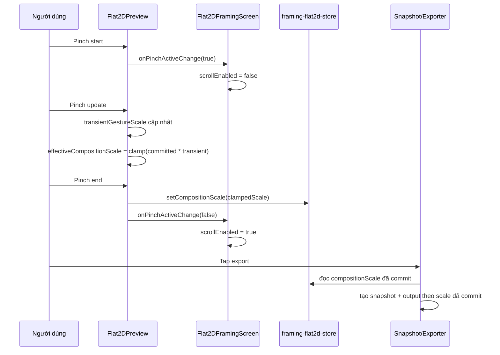

# Thiết kế: add-flat2d-framing-pinch-zoom

## 1. Phân tích khoảng trống

| Đã có | Cần thêm | Hành động |
|---|---|---|
| Preview Flat2D bằng Skia | Pinch zoom trực tiếp trên preview | Bọc preview bằng `GestureDetector` + `Gesture.Pinch()` |
| Store Flat2D với state draft | Scale riêng cho composition | Thêm `compositionScale` + actions reset/set |
| Placement contract preview/export | Scale commit dùng chung | Mở rộng `resolveFlat2DLayout()` nhận `compositionScale` |
| Snapshot cache theo signature | Cache invalidation khi pinch đổi scale | Nối `compositionScale` vào signature |
| ScrollView editor hiện tại | Phối hợp pinch và scroll | Toggle `scrollEnabled` trong phiên pinch |

## 2. Quyết định kiến trúc

### QĐ-1: Dùng `compositionScale` riêng, không ghi đè `printSizeCm`

**Quyết định**: Thêm `compositionScale` mặc định `1` vào `framing-flat2d-store.ts`.

**Lý do**: `printSizeCm` là dữ liệu vật lý người dùng nhập. Pinch zoom là tương tác composition-level cho cả artwork + mat + frame, nên tách khỏi dữ liệu kích thước in để tránh semantic mập mờ.

### QĐ-2: Pinch session dùng state tạm, chỉ commit khi kết thúc

**Quyết định**: Trong lúc pinch, preview dùng `transientGestureScale`; khi gesture kết thúc mới commit `compositionScale` về store.

**Lý do**: Tránh ghi Zustand state liên tục ở tần suất frame-level, giảm re-render và giữ interaction mượt.

### QĐ-3: Clamp pinch trước khi commit

**Quyết định**: `effectiveCompositionScale` bị kẹp trong `[0.25, maxCompositionScale]`.

**Lý do**: Tránh commit state không export được. `maxCompositionScale` được suy ra từ `safeRectPx`, `anchorPx`, và outer rect canonical hiện tại.

### QĐ-4: Export chỉ dùng scale đã commit

**Quyết định**: Preview có thể dùng `transientGestureScale` trong lúc pinch, nhưng `artwork-snapshot` và hidden exporter chỉ dùng `compositionScale` đã commit.

**Lý do**: Export phải deterministic. Nếu export phụ thuộc vào state transient của gesture đang diễn ra, preview/export parity sẽ khó kiểm soát.

### QĐ-5: Khóa `ScrollView` trong phiên pinch

**Quyết định**: Screen cha truyền callback vào preview để tắt `scrollEnabled` khi pinch active và bật lại khi kết thúc/hủy.

**Lý do**: Preview hiện nằm trong `ScrollView`, nên đây là nơi xung đột gesture dễ xảy ra nhất.

## 3. Hợp đồng dữ liệu

### Store

```ts
interface FramingFlat2DDraftState {
  compositionScale: number; // default 1
}
```

Actions mới:

```ts
setCompositionScale(scale: number)
resetCompositionScale()
```

### Layout contract

```ts
resolveFlat2DLayout({
  placement,
  printSizeCm,
  matWidthCm,
  frameFaceWidthCm,
  baseScale,
  compositionScale,
})
```

### Snapshot signature

```ts
${artworkUri}:${framePresetId}:${printWidthCm}:${printHeightCm}:${matWidthCm}:${compositionScale}
```

## 4. Luồng tương tác



## 5. Ma trận rủi ro

| Component | Rủi ro | Mức độ | Giảm thiểu |
|---|---|---|---|
| Preview gesture | Pinch bị cuộn trang cướp mất | MEDIUM | Toggle `scrollEnabled` khi pinch active |
| Store contract | Pinch làm bẩn `printSizeCm` | LOW | Dùng state `compositionScale` riêng |
| Snapshot cache | Export tái dùng snapshot sai scale | MEDIUM | Signature thêm `compositionScale` + test |
| Preview/export parity | Preview khác export sau pinch | MEDIUM | Dùng chung `compositionScale` và test parity |

## 6. Ghi chú bổ sung

### Công thức scale hiệu lực

```ts
effectiveCompositionScale = clamp(
  committedCompositionScale * transientGestureScale,
  MIN_COMPOSITION_SCALE,
  maxCompositionScale
)
```

### Nguyên tắc quan trọng

- `printSizeCm` không đổi vì pinch
- `compositionScale` áp vào toàn bộ mockup
- Export chỉ dùng `compositionScale` đã commit
- Auto-fit vẫn giữ vai trò guard cuối cùng, nhưng pinch sẽ clamp trước để UX dễ đoán hơn
