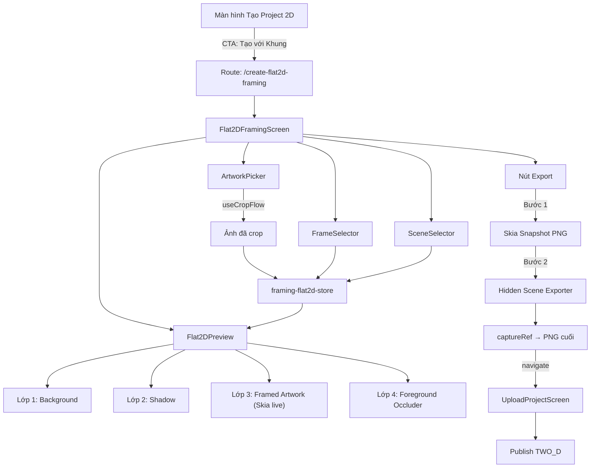
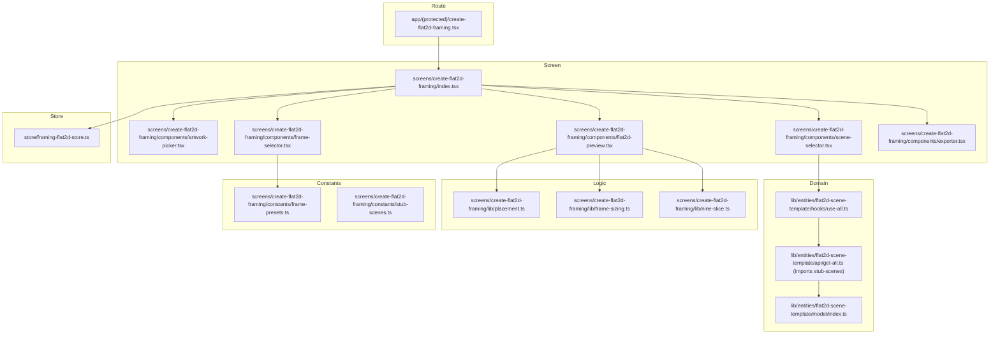
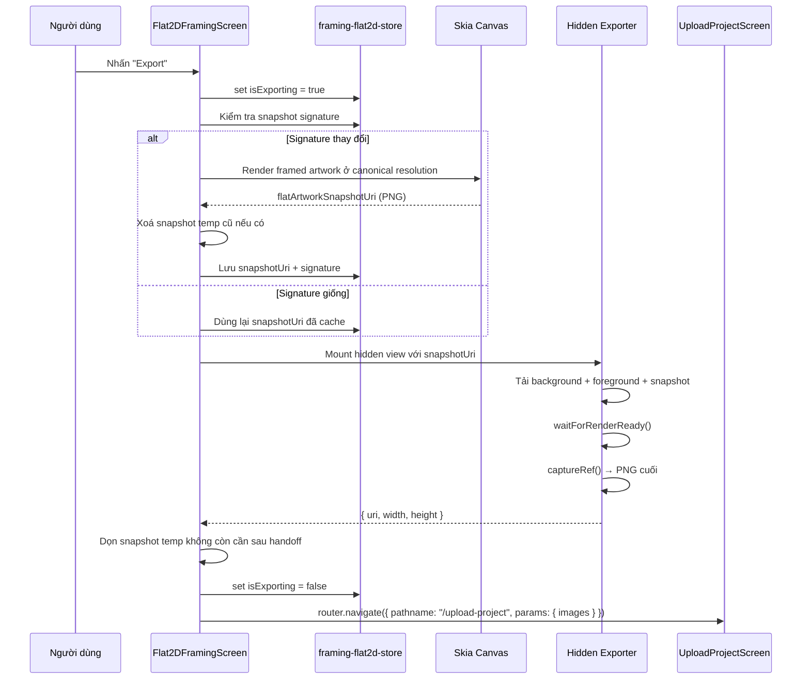

# Thiết kế: add-flat2d-framing

## 1. Phân tích khoảng trống

| Đã có | Cần thêm | Hành động |
|---|---|---|
| Skia: Canvas, Path, vec | 9-slice image rendering | Dùng `drawImageNine` hoặc tạo custom 9-slice bằng `drawImageRect` cho 9 vùng |
| Pattern hidden export view | Exporter scene Flat2D | Tạo component mới theo pattern `WallOverlayExporter` |
| `useCropFlow` hook | Chọn artwork đơn | Dùng `expo-image-picker` lấy ảnh → bọc lại vào `ImageForCrop` → pass qua `useCropFlow` |
| `UploadProjectScreen` | Bàn giao ảnh export | Tái sử dụng trực tiếp — navigate với params `images` |
| Entity FSD: `scene-template/` | Entity FSD: `flat2d-scene-template/` | Tạo mới song song, cùng cấu trúc api/hooks/model |
| Zustand stores (persist) | Store editor Flat2D (no persist) | Tạo store mới tại `store/framing-flat2d-store.ts` |
| Route `create-panorama.tsx` | Route `create-flat2d-framing.tsx` | Tạo route theo cùng pattern |
| Localization en/vi | Message IDs cho Flat2D | Bổ sung vào file existing |

## 2. Quyết định kiến trúc

### QĐ-1: Tách entity Flat2D khỏi SceneTemplate 3D

**Quyết định**: Tạo entity mới `lib/entities/flat2d-scene-template/` hoàn toàn tách biệt.

**Lý do**: Model 3D hiện tại (`SceneTemplate`) gắn chặt với `camera`, `dimensions`, `slots` — hoàn toàn không liên quan đến 2D orthogonal. Nhồi thêm 2D vào sẽ sinh logic phân nhánh, khó bảo trì.

**Khác biệt so với docs dự án**: Đồng nhất — spec `SPEC-framing-flat2d-v2.vi.md` đã nêu rõ quyết định này.

### QĐ-2: Store không persist

**Quyết định**: `framing-flat2d-store.ts` dùng `zustand` thuần, KHÔNG dùng middleware `persist`.

**Lý do**: V1 không hỗ trợ lưu draft lên backend. State editor chỉ sống trong phiên chỉnh sửa. Persist vào AsyncStorage tạo thêm complexity không cần thiết — nếu user exit, draft mất.

### QĐ-3: 9-slice rendering bằng Skia drawImageRect

**Quyết định**: Dùng hàm `drawImageRect` của Skia để vẽ 9 vùng riêng biệt thay vì `drawImageNine`.

**Lý do**: `drawImageNine` có tồn tại trong `@shopify/react-native-skia` v2.2.12 ở canvas imperative API, nhưng v1 đang đi theo pipeline JSX/declarative cho preview. Để giữ nhất quán với pipeline hiện tại và dễ test thuần hàm (src/dst rects), chọn cách chia ảnh frame thành 9 vùng (4 góc + 4 cạnh + 1 center) rồi vẽ bằng `drawImageRect`. Đây là pattern chuẩn của nine-patch rendering trong các engine 2D và không khóa hướng nâng cấp sang `drawImageNine` sau này.

### QĐ-4: Preview dùng expo-image, Export dùng RN Image

**Quyết định**: Background/foreground trong preview dùng `expo-image` (hiệu năng cao, caching tốt). Hidden exporter dùng `Image` từ `react-native` (tương thích `captureRef`).

**Lý do**: `expo-image` render off-thread nên pixel không capture được bằng `react-native-view-shot`. Pattern này đã được xác nhận trong comment của `composer-screen.tsx`.

### QĐ-5: Stub data dùng react-query interface

**Quyết định**: Stub scene data được đặt tại `screens/create-flat2d-framing/constants/stub-scenes.ts`. Hook `useAllFlat2DSceneTemplates()` bọc `useQuery`, còn tầng API chỉ import dữ liệu constants này trong v1. Khi backend sẵn sàng, chỉ đổi `queryFn` thành API call.

**Lý do**: Giữ nguyên interface cho UI components, swap nguồn dữ liệu không cần thay đổi UI.

### QĐ-6: Luồng chọn input không tuần tự

**Quyết định**: User có thể chọn artwork, frame, scene theo bất kỳ thứ tự nào. Preview render bất kỳ thứ gì đã sẵn sàng.

**Lý do**: UX linh hoạt hơn — user có thể chọn scene trước rồi mới chọn artwork, hoặc ngược lại. Store coi mỗi input là nullable.

### QĐ-7: Hệ toạ độ canonical pixel-only (không normalize ratio)

**Quyết định**: Toàn bộ placement, auto-fit và export làm việc trong không gian pixel canonical của scene. KHÔNG có bước trung gian normalize sang ratio.

**Lý do**: Mâu thuẫn đã phát hiện giữa spec scene-selection (yêu cầu ratio) và preview-canvas/auto-fit (dùng pixel). Bước chuyển đổi thừa tạo floating-point errors và complexity không cần thiết. Hệ toạ độ canonical pixel là source-of-truth duy nhất:

- **Preview**: `displayCoords = canonicalCoords * previewScale`
- **Export**: `exportCoords = canonicalCoords` (dùng trực tiếp)
- **Resolver**: module `placement.ts` là điểm chuyển đổi duy nhất, nhận `previewScale` hoặc `1.0` (export)

### QĐ-8: Auto-fit dùng khoảng cách anchor→cạnh, không dùng width/height đối xứng

**Quyết định**: `calcAutoFit()` tính scale từ khoảng cách thực tế từ `anchorPx` đến bốn cạnh của `safeRectPx`, thay vì chỉ dùng `safeRectPx.width / outerWidthPx` và `safeRectPx.height / outerHeightPx`.

**Lý do**: `safeRectPx` có thể lệch tâm so với `anchorPx`. Công thức đối xứng theo width/height chỉ đúng khi anchor nằm đúng tâm safe rect. Dùng khoảng cách đến từng cạnh mới đảm bảo rect sau scale vẫn nằm trọn trong safe rect khi giữ tâm tại anchor.

## 3. Sơ đồ kiến trúc

### 3.1 Luồng tổng quan



### 3.2 Cấu trúc file



### 3.3 Pipeline export chi tiết



## 4. Ma trận rủi ro

| Component | Rủi ro | Mức độ | Giảm thiểu |
|---|---|---|---|
| 9-slice renderer (Skia) | Không render đúng 9 vùng, góc bị stretch | MEDIUM | Tạo unit test với ảnh frame mẫu; kiểm tra pixel output |
| Preview/export parity | Vị trí artwork lệch giữa preview và export | MEDIUM | Module `placement.ts` dùng chung; shared layer order; automated parity test assert tọa độ/layer order khớp |
| Export pipeline | `captureRef` trả ảnh trắng hoặc thiếu layer | MEDIUM | Pattern `waitForRenderReady` đã chứng minh trong `composer-screen.tsx` |
| Auto-fit calculation | Scale sai, artwork bị lệch khỏi anchor | LOW | Unit test với các case boundary: vừa khít, vượt 1 chiều, vượt 2 chiều, safe rect lệch tâm |
| Navigation handoff | Params sai format, UploadProjectScreen crash | LOW | Dùng đúng contract `{ id, uri, width, height }`; test navigation |
| Stub→API chuyển đổi | Hook interface thay đổi khi swap nguồn | LOW | `useQuery` interface giữ nguyên; chỉ đổi `queryFn` |
| Frame assets thiếu | Không có ảnh PNG frame để demo | LOW | Tạo 3 frame assets đơn giản (solid color borders) |

## 5. Ghi chú thiết kế bổ sung

### Toạ độ canonical pixel (QUY ƯỜC CHIẾU TOÀN BỘ)

Toàn bộ placement/auto-fit/export dùng hệ toạ độ pixel canonical của scene. KHÔNG có bước trung gian ratio.

```
Template cung cấp: anchorPx, safeRectPx, sceneSizePx, pixelsPerCm
→ Tất cả đều là pixel trong không gian scene gốc.

Khi render PREVIEW:
  previewScale = min(viewWidth / sceneWidthPx, viewHeight / sceneHeightPx)
  displayX = anchorPx.x * previewScale
  displayY = anchorPx.y * previewScale
  displayOuterW = outerWidthPx * previewScale

Khi render EXPORT:
  exportX = anchorPx.x     // dùng trực tiếp
  exportY = anchorPx.y
  exportOuterW = outerWidthPx  // dùng trực tiếp

Resolver chung:
  resolve(canonicalRect, scale) => { left: rect.left * scale, ... }
  preview: resolve(canonicalRect, previewScale)
  export:  resolve(canonicalRect, 1.0)
```

Điểm mấu chốt: `placement.ts` là resolver duy nhất. Cả preview và export đều gọi cùng hàm, chỉ khác tham số `scale`.

### Auto-fit với safe rect lệch tâm

```
leftClearancePx = max(0, anchorPx.x - safeRectPx.x)
rightClearancePx = max(0, safeRectPx.x + safeRectPx.width - anchorPx.x)
topClearancePx = max(0, anchorPx.y - safeRectPx.y)
bottomClearancePx = max(0, safeRectPx.y + safeRectPx.height - anchorPx.y)

maxFitWidthPx = 2 * min(leftClearancePx, rightClearancePx)
maxFitHeightPx = 2 * min(topClearancePx, bottomClearancePx)

scale = min(1, maxFitWidthPx / outerWidthPx, maxFitHeightPx / outerHeightPx)
```

Điểm mấu chốt: công thức này vẫn fit đúng ngay cả khi `anchorPx` không nằm ở tâm `safeRectPx`.

### 9-slice rendering flow

```
Input: frameImage, innerRect, nineSliceInsets { left, top, right, bottom }

1. Tính 9 src rects (vùng cắt trên ảnh gốc)
2. Tính 9 dst rects (vùng đích trên canvas)
3. Vẽ 4 góc: drawImageRect(src_corner, dst_corner) — không scale
4. Vẽ 4 cạnh: drawImageRect(src_edge, dst_edge) — scale 1 chiều
5. Vẽ center: drawImageRect(src_center, dst_center) — scale 2 chiều (nếu nhìn thấy)
```

### Outer size calculation

```ts
outerWidthCm = printWidthCm + 2 * (matWidthCm + frameFaceWidthCm)
outerHeightCm = printHeightCm + 2 * (matWidthCm + frameFaceWidthCm)
outerWidthPx = outerWidthCm * pixelsPerCm
outerHeightPx = outerHeightCm * pixelsPerCm
```
