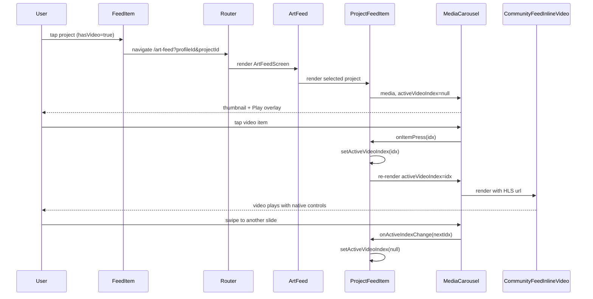

# Design: feed-video-playback

## Architecture Decisions

### AD1: Backend additive — chỉ thêm `type`, không tách `hlsUrl`
Phase này giữ contract đơn giản: thêm `type` từ `Media.type` vào `ProjectImage`. FE tự logic `mediumUrl ?? url` cho video (HLS preferred) — đồng bộ với pattern `SubmissionMediaModal` đã có. Phase sau có thể tách field `hlsUrl` riêng nếu cần multi-quality.

### AD2: Tái sử dụng `SubmissionMediaModal` pattern cho art-feed
Không tạo component video player mới. Dùng `MediaCarousel` (đã hỗ trợ `activeVideoIndex`, `onItemPress`, `onActiveIndexChange`) với controlled active-index pattern. Đảm bảo consistency UX cross-feature và giảm code trùng.

### AD3: Feed dùng flag `hasVideo` thay vì truyền cả `images[]`
`MasonryItemData` đã được optimize cho memoization (`useOptimizedMasonryItems`). Thêm flag boolean `hasVideo` thay vì pass nguyên `images[]` array để giữ shallow equality và tránh re-render không cần thiết.

### AD4: Cover thumbnail fallback ưu tiên image
`transformProjectToMasonryItem` ưu tiên `IMAGE` đầu tiên làm cover. Fallback `firstVideo.thumbnailUrl` (Vimeo trả về thumbnail có sẵn). Tránh case Vimeo player URL bị render bằng `<Image>` → broken image.

### AD5: Reset active video theo `project.id` và carousel index
`ProjectFeedItem` được render theo project khác nhau khi user scroll FlashList. Dùng `useEffect` reset `activeVideoIndex=null` khi `project.id` thay đổi. `MediaCarousel` gọi `onActiveIndexChange` khi snap sang slide khác để parent clear active video index, tránh video phát ngầm/offscreen.

## Risk Map

| Risk | Level | Mitigation |
|------|-------|------------|
| `mapProjectData` HIGH risk theo gitnexus (6 callers, 3 processes) | MEDIUM | Additive change only — thêm field `type`, không sửa signature/structure. Callers consume output không break. |
| Project full video → cover broken | LOW | Fallback `firstVideo.thumbnailUrl`. |
| FE old client không có `type` field | LOW | `type` đặt optional ở FE type (`type?: "IMAGE" | "VIDEO"`); transform đã guard `i.type === "VIDEO"` (false nếu undefined). |
| Multiple videos trong carousel — tap 1 rồi swipe vẫn active/offscreen | LOW | Track `activeVideoIndex` và clear qua `onActiveIndexChange`. |
| `mediumUrl` lẫn lộn ý nghĩa (image medium-size vs video HLS) | LOW | Document trong code comment ngắn. Phase sau tách `hlsUrl`. |

## File Map

### Backend (riz-be)
- `apps/nest/libs/project/src/helpers/project-mapper.helper.ts` — type def + mapper output thêm `type: MediaType | null`.
- `apps/nest/libs/project/src/entities/project.entity.ts` — `ProjectImageEntity.type` với `@ApiPropertyOptional` + `@Expose`; `ProjectEntity.hasVideo`.
- `apps/nest/libs/project/src/project.service.ts` — list/detail include `_count.attachments` video và mapper private emit `images[].type`/`hasVideo`.
- `apps/nest/libs/project/src/admin-trending.service.ts` — shared `FEED_GLOBAL_INCLUDE` cho attachments + video `_count`.
- `apps/nest/libs/challenge/src/challenge.service.ts` — Vimeo challenge videos persist bằng `PROJECT_IMAGE`.

### Mobile (riz-app-v2)
- `lib/api/projects/types.ts` — `ProjectImage.type?: "IMAGE" | "VIDEO"` (DOCUMENT có thể bỏ vì project images chỉ IMAGE/VIDEO).
- `screens/feed/types/types.ts` — `MasonryItemData.hasVideo: boolean`.
- `screens/feed/helper/transform.ts` — tính `hasVideo` + cover fallback logic.
- `screens/feed/components/main/feed-item.tsx` — Play overlay khi `item.hasVideo`.
- `components/media-carousel/types.ts` — `activeVideoIndex`, `onActiveIndexChange`.
- `components/media-carousel/media-carousel.tsx` — chỉ active video khi active index trùng current slide; emit active-index changes.
- `screens/art-feed/components/project-feed-item.tsx` — map `type` từ `img.type`, state `activeVideoIndex`, `onItemPress` handler, reset theo `project.id` và carousel index.
- `screens/challenges/components/submission-media-modal.tsx` — đồng bộ `MediaCarousel` prop contract.
- `screens/community/components/community-feed-item.tsx` — đồng bộ `MediaCarousel` prop contract.
- `screens/community/components/pending-post-card.tsx` — đồng bộ `MediaCarousel` prop contract.

## Interface Sketch

